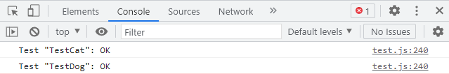
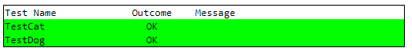

# test.js

test.js is a lightweight unit test framework intended to be used for JS
applications that don't want to pull in the weight of nodejs, npm, etc.
This file has no other dependencies. It is intended to be used as a JS
module.

To use:
1. Copy this file near your other Javascript files.
2. Use `import { addTest, runTests } from './test.js';` to an existing JS
   file.
3. Define unit tests in or near the application code with addTest().
4. Visit `http://[your url]?run_tests=1` to execute the tests and see the
   results. Default behaviors are provided for easy setup, but they can be
   overridden.

See example/ for a minimal example web site that uses test.js.

### Example console output:

### Example DOM output

# API Documentation

## Classes

<dl>
<dt><a href="#TestCase">TestCase</a></dt>
<dd>
Passed to test functions to help verify test behavior.
Test execution will stop when fail() is called or when any behavior
assertion fails. (all assertions call fail() internally)
The TestCase instance is provided to the test function by this testing
framework.

</dd>
<dt><a href="#Renderer">Renderer</a></dt>
<dd>
A base class for displaying unit test results.
It does little on its own, but can be subclassed to provide custom rendering
behaviors.
Subclasses must define:
renderBoilerplate(options):
    options: the same object received by runTests().
renderOneTest(options, table, testName, status, stack, hexColor):
    options: the same object received by runTests()
    table: the container the test result should be added to
    testName: the name of the test that was executed
    status: a string status for display. Probably &#39;OK&#39;, &#39;FAIL&#39;, or &#39;SKIPPED&#39;.
    stack: the call stack of a failed test
    color: a color associated with the display. Different status codes
        correspond to different colors.

</dd>
<dt><a href="#ConsoleRenderer">ConsoleRenderer</a></dt>
<dd>
ConsoleRenderer displays test output to the browser&#39;s debug console.
See Renderer for details of methods.

</dd>
<dt><a href="#DomRenderer">DomRenderer</a></dt>
<dd>
ConsoleRenderer displays test elements by creating DOM elements in the web
page itself.
See Renderer for details of methods.

</dd>
</dl>

## Functions

<dl>
<dt><a href="#runTests">runTests(options)</a> ⇒ <code>boolean</code></dt>
<dd>
Run tests and render the results using the supplied renderer. runTests()
will examine the page URL to decide whether to run tests at all. This allows
the setup code in the application to be less intrusive, since runTests() can
be run blindly.

</dd>
<dt><a href="#addTest">addTest(testName, testFn)</a></dt>
<dd>
Adds a test to the set of tests to run.
All tests registered by addTest() will be executed when runTests() is called
(excepting the behaviors of the runTestsParam and runOnlyParam options).

</dd>
</dl>

## Typedefs

<dl>
<dt><a href="#testFn">testFn</a> : <code>function</code></dt>
<dd></dd>
<dt><a href="#exceptionFn">exceptionFn</a> : <code>function</code></dt>
<dd></dd>
</dl>

## TestCase
Passed to test functions to help verify test behavior.
Test execution will stop when fail() is called or when any behavior
assertion fails. (all assertions call fail() internally)
The TestCase instance is provided to the test function by this testing
framework.

**Kind**: global class

* [TestCase](#TestCase)
    * [new TestCase()](#new_TestCase_new)
    * [.fail(msg)](#TestCase+fail)
    * [.true(actual)](#TestCase+true)
    * [.false(actual)](#TestCase+false)
    * [.equals(expected, actual)](#TestCase+equals)
    * [.notEquals(expected, actual)](#TestCase+notEquals)
    * [.objEquals(expected, actual)](#TestCase+objEquals)
    * [.objNotEquals(expected, actual)](#TestCase+objNotEquals)
    * [.defined(actual)](#TestCase+defined)
    * [.exception(failingFn, string)](#TestCase+exception)

### new TestCase()
The constructor is not needed by applications.

### testCase.fail(msg)
Causes a test case to fail, with the specified error message.

**Kind**: instance method of [<code>TestCase</code>](#TestCase)

| Param | Type | Description |
| --- | --- | --- |
| msg | <code>string</code> | the message to display in the test results |

### testCase.true(actual)
Causes the test to fail if actual not equal to true. Values that
implicitly convert to true, such as 1 or 'abc', are insufficient.
true is the same as equals(true, actual);

**Kind**: instance method of [<code>TestCase</code>](#TestCase)

| Param | Type | Description |
| --- | --- | --- |
| actual | <code>\*</code> | the value to compare to true |

### testCase.false(actual)
Causes the test to fail if actual not equal to false. Values that
implicitly convert to false, such as 0 or '', are insufficient.
false is the same as equals(false, actual);

**Kind**: instance method of [<code>TestCase</code>](#TestCase)

| Param | Type | Description |
| --- | --- | --- |
| actual | <code>\*</code> | the value to compare to false |

### testCase.equals(expected, actual)
Causes the test to fail if actual is not equal to expected.
For object types, the objects must be exactly the same instance or reference.
Object keys are not traversed for equivalence.

**Kind**: instance method of [<code>TestCase</code>](#TestCase)

| Param | Type | Description |
| --- | --- | --- |
| expected | <code>\*</code> | the expected value, defined by the test code |
| actual | <code>\*</code> | the actual value produced by running the tested code |

### testCase.notEquals(expected, actual)
Causes the test to fail if actual is equal to expected.

**Kind**: instance method of [<code>TestCase</code>](#TestCase)

| Param | Type | Description |
| --- | --- | --- |
| expected | <code>\*</code> | the expected value, defined by the test code |
| actual | <code>\*</code> | the actual value produced by running the tested code |

### testCase.objEquals(expected, actual)
Causes the test to fail if actual is not recursively
equivalent to expected.
Equivalence is determined by converting both actual and expected to JSON,
then verifying that the JSON is identical.

**Kind**: instance method of [<code>TestCase</code>](#TestCase)

| Param | Type | Description |
| --- | --- | --- |
| expected | <code>\*</code> | the expected value, defined by the test code |
| actual | <code>\*</code> | the actual value produced by running the tested code |

### testCase.objNotEquals(expected, actual)
Causes the test to fail if actual is recursively
equivalent to expected.
Equivalence is determined by converting both actual and expected to JSON,
then verifying that the JSON is identical.

**Kind**: instance method of [<code>TestCase</code>](#TestCase)

| Param | Type | Description |
| --- | --- | --- |
| expected | <code>\*</code> | the expected value, defined by the test code |
| actual | <code>\*</code> | the actual value produced by running the tested code |

### testCase.defined(actual)
Causes the test to fail if actual is undefined or null;

**Kind**: instance method of [<code>TestCase</code>](#TestCase)

| Param | Type | Description |
| --- | --- | --- |
| actual | <code>\*</code> | the actual value produced by running the tested code |

### testCase.exception(failingFn, string)
Causes the test to fail if failingFunc does not throw an exception when
executed, or if the exception message does not contain the errorFragment
string.
This enables a test to verify when a function is expected to fail, and
that when it fails it fails in the expected way.

**Kind**: instance method of [<code>TestCase</code>](#TestCase)

| Param | Type | Description |
| --- | --- | --- |
| failingFn | [<code>exceptionFn</code>](#exceptionFn) | The function to test for failure. This will be executed automatically by exception(), and passed no arguments. |
| string | <code>errorFragment</code> | an expected fragment of the exception error message. |

## runTests(options) ⇒ <code>boolean</code>
Run tests and render the results using the supplied renderer. runTests()
will examine the page URL to decide whether to run tests at all. This allows
the setup code in the application to be less intrusive, since runTests() can
be run blindly.

**Kind**: global function
**Returns**: <code>boolean</code> - true if tests are executed, false if tests are skipped

| Param | Type | Description |
| --- | --- | --- |
| options | <code>object</code> | options to configure the behavior of the test framework |
| options.renderer | <code>object</code> | The renderer used to display the results. By default, ConsoleRenderer will be used. |
| options.runTestsParam | <code>string</code> | A URL param to toggle when tests should run. By default, 'options.run_tests' is used. If the param is set to '1' in the URL, tests will be executed and this function will return true. Otherwise, this function will do nothing and it will return false. For example: http: *example.com?run_tests=1 |
| options.runOnlyParam | <code>string</code> | A URL param to control which specific test cases are run. By default, 'run_only' is used. The param should be set to a regular expression pattern. Any test name that has a partial match with the pattern will be executed. All other tests will be skipped. If this option is omitted, all tests will be executed. For example: http: *example.com?run_tests=1&run_only=TestMagical.* |

## addTest(testName, testFn)
Adds a test to the set of tests to run.
All tests registered by addTest() will be executed when runTests() is called
(excepting the behaviors of the runTestsParam and runOnlyParam options).

**Kind**: global function

| Param | Type | Description |
| --- | --- | --- |
| testName | <code>string</code> | string, the name of the test case. |
| testFn | [<code>testFn</code>](#testFn) | Defines a test behavior, and executes that behavior when called. |

## testFn : <code>function</code>
**Kind**: global typedef

| Param | Type | Description |
| --- | --- | --- |
| testCase | [<code>TestCase</code>](#TestCase) | Methods on the TestCase should be called in the function body to define the outcome of the test. |

## exceptionFn : <code>function</code>
**Kind**: global typedef
